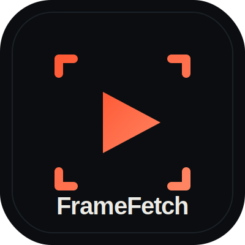

<p align="center">
  
</p>

<h1 align="center">FrameFetch</h1>

<p align="center">
  <b>Any social-video URL → metadata, transcript, insights, frames &amp; on-screen text (OCR).</b><br>
  Agent-first video data API + MCP server. Pay per call, or with x402 (USDC) — no account.
</p>

<p align="center">
  <a href="https://www.npmjs.com/package/framefetch"></a>
  <a href="https://framefetch.net"></a>
  <a href="https://framefetch.net/status"></a>
  
</p>

---

FrameFetch turns one **YouTube, YouTube Shorts, TikTok, Instagram Reels, Pinterest, or Reddit** video URL into a single JSON response: **metadata**, **engagement insights**, a **transcript** (captions or Whisper), **parametrically-sampled frames** (every Nth / 1-per-second / a time range, at any width), and the **on-screen text burned into those frames** (OCR — captions, price tags, signage). Built API-first and MCP-first for AI agents.

> This repo is the **open-source client + docs**. The service itself runs at **[framefetch.net](https://framefetch.net)** — you bring a free API key (or pay per call with x402); the backend stays hosted.

## Why

An LLM can't watch a video. To reason about one it needs the video turned into text and images first — a transcript, metadata, and a few frames. FrameFetch returns all three from a URL, across six platforms, through one schema.

## Install

```bash
npm install framefetch
```

Node 18+ (uses built-in `fetch`). Get a free key: [framefetch.net](https://framefetch.net).

## Quick start

```js
import { FrameFetch } from 'framefetch';

const ff = new FrameFetch({ apiKey: process.env.FRAMEFETCH_API_KEY });

const r = await ff.extract({
  url: 'https://www.youtube.com/watch?v=jNQXAC9IVRw',
  fields: ['metadata', 'transcript', 'frames', 'text_overlay'],
  frames: { mode: 'fps', fps: 1, width: 480 },
});

console.log(r.metadata.title);        // "Me at the zoo"
console.log(r.transcript.text);       // "Alright, so here we are…"
console.log(r.frames.count);          // 19
console.log(r.textOverlay?.[0]?.text); // on-screen text detected in the first frame, if any
```

### Scoped helpers

```js
await ff.metadata(url);    // title, author, duration, views, likes…
await ff.transcript(url);  // captions, else Whisper
await ff.frames(url, { mode: 'fps', fps: 1, width: 512 });
await ff.platforms();      // capability matrix (no key)
await ff.status();         // live service health (no key)

// on-screen text (OCR) — requires "frames" alongside it, use extract() directly:
await ff.extract({ url, fields: ['frames', 'text_overlay'], frames: { mode: 'fps', fps: 1 } });
```

### No signup

```js
const ff = new FrameFetch();                              // no key
await ff.demo('https://youtu.be/jNQXAC9IVRw');            // instant metadata, rate-limited
const { key } = await ff.createKey('you@example.com');    // self-serve key + free credit
```

## Use it from an MCP agent

FrameFetch ships an MCP server (Streamable HTTP) with the tools `framefetch_extract` and `framefetch_platform_capabilities`. Add it to Claude, Cursor, or any MCP client:

```json
{
  "mcpServers": {
    "framefetch": {
      "url": "https://framefetch.net/mcp",
      "headers": { "Authorization": "<YOUR_FRAMEFETCH_KEY>" }
    }
  }
}
```

Or one line:

```bash
claude mcp add --transport http framefetch https://framefetch.net/mcp \
  --header "Authorization: <YOUR_FRAMEFETCH_KEY>"
```

### Local stdio bridge

Prefer a local stdio server (Claude Desktop, sandboxes, no inbound HTTP)? This package
ships `framefetch-mcp`, a zero-dependency stdio↔HTTP bridge that exposes the same tools
and forwards calls to `framefetch.net`:

```json
{
  "mcpServers": {
    "framefetch": {
      "command": "npx",
      "args": ["-y", "framefetch-mcp"],
      "env": { "FRAMEFETCH_API_KEY": "<YOUR_FRAMEFETCH_KEY>" }
    }
  }
}
```

`tools/list` works with no key; tool calls use `FRAMEFETCH_API_KEY` (or x402). Override the
endpoint with `FRAMEFETCH_MCP_URL`.

## Pay without an account (x402)

Autonomous agents can pay per call in **USDC via x402** on Base — no signup, no human in the loop. Discoverable in the x402 Bazaar and at [`/.well-known/x402.json`](https://framefetch.net/.well-known/x402.json). Humans can use a free tier, prepaid credits, or a Stripe card.

## Errors

```js
import { FrameFetchError } from 'framefetch';
try {
  await ff.transcript(url);
} catch (e) {
  if (e instanceof FrameFetchError && e.status === 402) {
    // out of credit — top up at framefetch.net or via x402
  }
}
```

## API surface

| Method | Endpoint | Auth |
| --- | --- | --- |
| `extract({ url, fields, frames })` | `POST /v1/extract` | key |
| `metadata(url)` | `POST /v1/metadata` | key |
| `transcript(url)` | `POST /v1/transcript` | key |
| `frames(url, spec)` | `POST /v1/frames` | key |
| `platforms()` | `GET /v1/platforms` | — |
| `status()` | `GET /v1/status` | — |
| `demo(url)` | `POST /v1/demo` | — |
| `createKey(email)` | `POST /v1/keys` | — |

Full OpenAPI: [framefetch.net/openapi.json](https://framefetch.net/openapi.json) · Docs: [framefetch.net/docs](https://framefetch.net/docs)

## Links

[Website](https://framefetch.net) · [Docs](https://framefetch.net/docs) · [Pricing](https://framefetch.net/pricing) · [Status](https://framefetch.net/status) · [Guide: giving an agent video data](https://framefetch.net/ai-agent-video-data) · [Compare vs alternatives](https://framefetch.net/compare-video-data-apis)

## License

MIT
